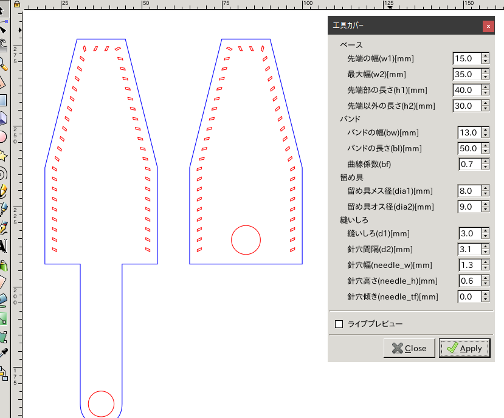

# PliersCover Inkscape extension

工具カバーのレザークラフト用図面を自動作成 (Inkscape extension)


## 概要

ラジオペンチやニッパーなどの工具カバーのレザークラフト用図面を自動作成する
Inkscapeエクステンション(拡張機能)です。

各部分のサイズを入力すると、
レーザーカッターなどで利用できる図面を自動作成します。

(もちろん、紙に印刷して、従来通りの手作業も可能。)

``ライブビュー``機能を利用すると、
画面上で確認しながらサイズを調整できます。

針穴は菱目で、位置は、必ず角に来るように自動的に調整されます。


## 1. インストール

1. Inkscapeのインストール
2. ダウンロード
3. ファイルのコピー

### 1.1 Inkscape

``Inkscape``の拡張機能なので、``Inkscape``が必要です。

まだ、インストールされていない場合は、
下記公式サイトを参考にインストールして下さい。

=> [Inkscape 公式サイト](https://inkscape.org/ja/)


### 1.2 ダウンロード

サイトのURL

[https://github.com/ytani01/PliersCover/](https://github.com/ytani01/PliersCover/)

ZIP形式のファイルをダウンロードして展開するか、
``git``に慣れている方は、慣れた方法でリポジトリをクローンしてください。

#### 1.2.1 ZIPファイルをダウンロードして展開する方法


#### 1.2.2 Gitリポジトリをクローン(clone)する方法

* 通常のやり方

```bash
$ git clone https://github.com/ytani01/PlierCover.git
```

* githubにsshの設定をしている場合

```bash
$ git clone git@github.com:ytani01/PlierCover.git
```


### 1.3 ファイルのコピー

以下の２つのファイルを所定のフォルダにコピーする。

コピーするファイル
* plier_cover.inx
* plier_cover.py

OSにあったやり方でコピーしてください。


#### 1.3.1 Linux

コピー先ディレクトリ(フォルダ)
* ユーザー毎
```
~/.config/inkscape/extensions
```

``setup.sh`` で自動的に上記ディレクトにコピーすることができます。
```bash
$ ./setup-linux.sh
```

* 全ユーザー(管理者権限が必要)
```
/usr/share/inkscape/extensions
```


#### 1.3.2 Mac

linuxと同じ？？


#### 1.3.3 Windows

コピー先フォルダ

* ユーザー毎
```
C:\Users\ユーザー名\AppData\Roaming\inkscape\extensions
```

* 全ユーザー(管理者権限が必要)
```
C:\Program Files\Inkscape\share\extensions)
```


## 2. 使い方

* メニューから以下を選択

[拡張(extensions, エクステンション)]-[ytani]-[工具カバー] 


* ダイヤログにサイズを入力



* ``[ライブビュー]`` をチェックすると、画面で確認しながらサイズを調整できます。

* ``[Apply(適用)]`` をクリックすると、確定されて、キャンパスに描画されます。
(ダイヤログは自動的に閉じません。)


### 2.1 注意・コツなど

* ``[Apply(適用)]`` を何度もクリックすると、クリックした回数重ね描きされます。
([編集]-[元に戻す]、または、[Ctrl]-[Z]で、元に戻すことができます。)

* ``[ライブビュー]``がチェックされている状態では、
画面の拡大縮小などの操作ができません。
拡大率や表示位置などを調整したいときは、
一旦、``[ライブビュー]``のチェックをはずして下さい。

* 角に、針穴が来るように自動調節されるので、
辺ごとに針穴の間隔が多少不揃いになることがあります。
縫いしろや針穴のパラメータを微調整調整して、
針穴が均等になるようにしましょう。

* Inkscapeに工具の写真をインポートして、
その上にこの拡張機能を重ねると、
サイズ合わせが楽です。


### 2.2 起動方法について

Inkscapeの``--verb``オプションで ``id``を指定すると、
Inkscape起動と同時にこの拡張機能を開くこともでき、
メニューから探す手間を省けます。

本拡張機能のID: ``jp.tanibayashi.yoichi.ytani.pliers_cover``


#### 2.2.1 Linuxのコマンドラインで起動する場合

```bash
$ inkscape --verb jp.tanibayashi.yoichi.ytani.pliers_cover
```


#### 2.2.2 Windowsのショートカットに登録する方法


## A. Memo

### A.1 SVG パスのコマンド

```
(大文字: 絶対座標、小文字: 相対座標)

M: moveto (始点座標)
L: lineto
  H: 水平
  V: 垂直
C: curveto: "{C|c} c1x,c1y c2x,c2y x,y"
  (c1x, c1y), (c2x, c2y): 制御点
  x,y: 終点

  * 正円(半円)の場合、制御点までの距離は、直径の約0,75倍(?)
Z: closepath
```

```
ex: d="M 50,60 H 60 l 20,50 Z"
```


### A.2 Inkscape extension 描画

#### 基本書式

```python
import inkex
import simplestyle

inkex.localize()

class Foo(inkex.Effect):
    def __init__(self):
	    inkex.Effect.__init__(self)
		self.OptionParser.add_option("--opt", action="store", type="float",dest="opt", help="...")
		

    def effect(self):
	    :
		
```

現在のレイヤーに、``object``を描画。

* ``style``: 線のスタイル、
* ``attribute``: 座標、サイズ
* ``inkex.addNS()``: 図形の種類(長方形、円、パスなど)と形式(SVGなど)


ex.1
```python
parent = self.current_layer
style = { ... }
attribute = { ... }
object = inkex.etree.SubElement(parent,
	inkex.addNS('rect', 'svg'),
	attribute)
```

#### style: 線のスタイル
ex.1
```python
style = {
  'stroke': '#000000',
  'stroke-width': '0.2',
  'fill': 'none'
}
```


#### attributes: 座標、サイズ

ex.1: rect
```python
attribs_rect = {
  'style': simplestyle.formatStyle(style),
  'width': '30',
  'height': '20',
  'x': '100',
  'y': '200'
}
```

ex.2: circle
```python
attribs_circle = {
  'style': simplestyle.formatStyle(style),
  'r': '100',
  'cx': '150',
  'cy': '200'
}
```

ex.3: path
```python
attribs_path = {
  'style': simplestyle.formatStyle(style),
  'd': 'M 50,60 H 60 l 20,50 Z'
}
```
